# IEC104 Simulator Releases

面向电力自动化场景的 IEC 60870-5-104 协议测试工具发布仓库，提供主站/从站双模式安装包下载、版本说明和使用文档。

## 项目简介

IEC104 协议模拟器是一款面向电力自动化场景的 IEC 60870-5-104 测试工具，支持主站（Master）与从站（Slave）双模式运行，可用于协议开发、设备联调、测试验证和问题定位。

主要能力包括：

- 主站模式
  - 连接从站设备
  - 发起总召、遥控、遥调、时钟同步等操作
  - 查看通信报文和运行状态
- 从站模式
  - 监听主站连接
  - 响应总召和控制命令
  - 导入点表并模拟数据变化
- 通用能力
  - 报文实时监控与结构化解析
  - SOE 事件记录
  - `PCAP/PCAPNG` 抓包导出
  - 本地数据持久化

## 下载

最新版本请前往：

- [Releases](../../releases)

常见安装包说明：

- `iec104-simulator-master_x.x.x_x64-setup.exe`
  IEC104 主站模拟器安装包
- `iec104-simulator-slave_x.x.x_x64-setup.exe`
  IEC104 从站模拟器安装包

如果某个版本同时提供两个安装包，请按需分别下载安装。

## 如何选择安装包

- 只需要模拟主站，下载 `master` 安装包
- 只需要模拟从站，下载 `slave` 安装包
- 需要本机联调，建议两个都安装

## 安装与使用文档

- [安装说明](./docs/install.md)
- [版本变更记录](./docs/changelog.md)

## 系统要求

当前公开版本主要支持：

- Windows 10 x64
- Windows 11 x64

如果后续发布 Linux 或 macOS 版本，会在对应 Release 中单独说明。

## 截图

从站首页
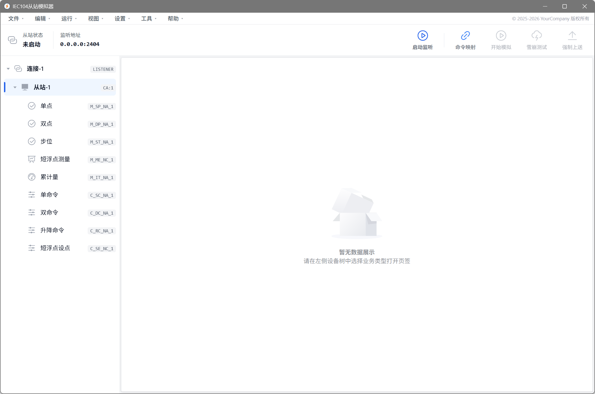
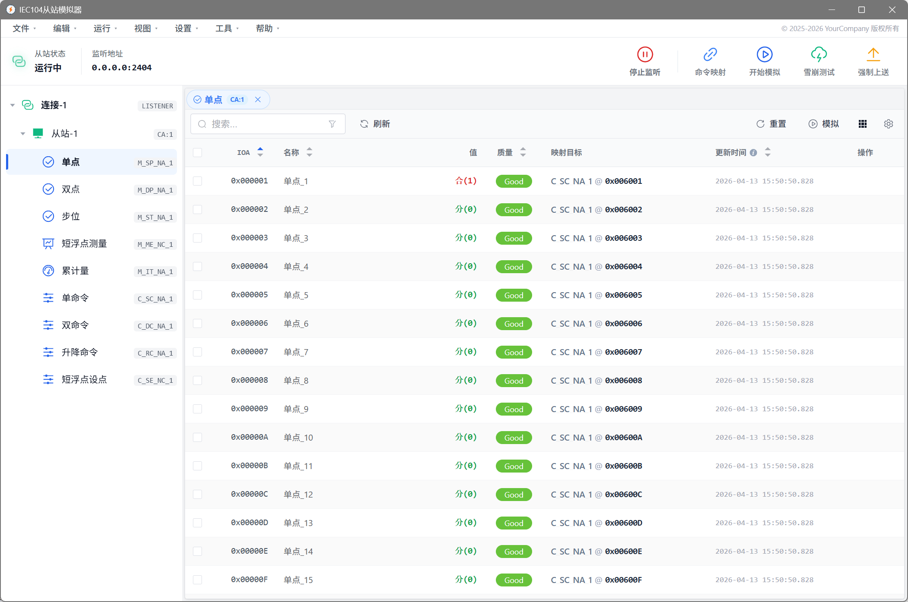

主站首页
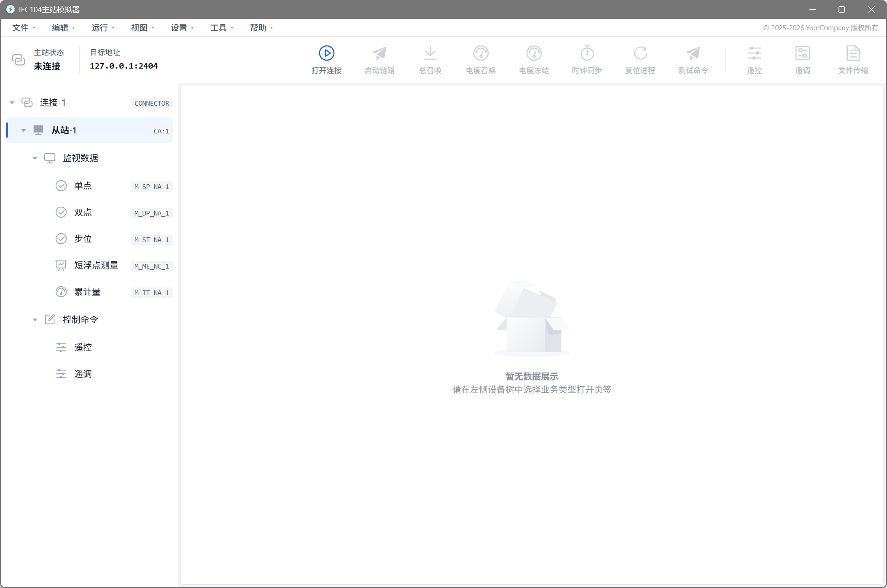
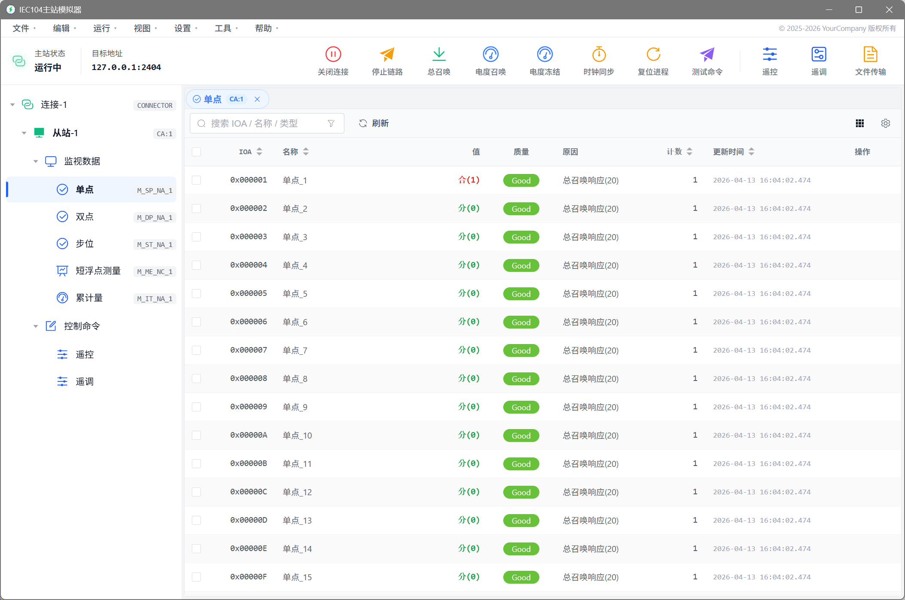

从站创建
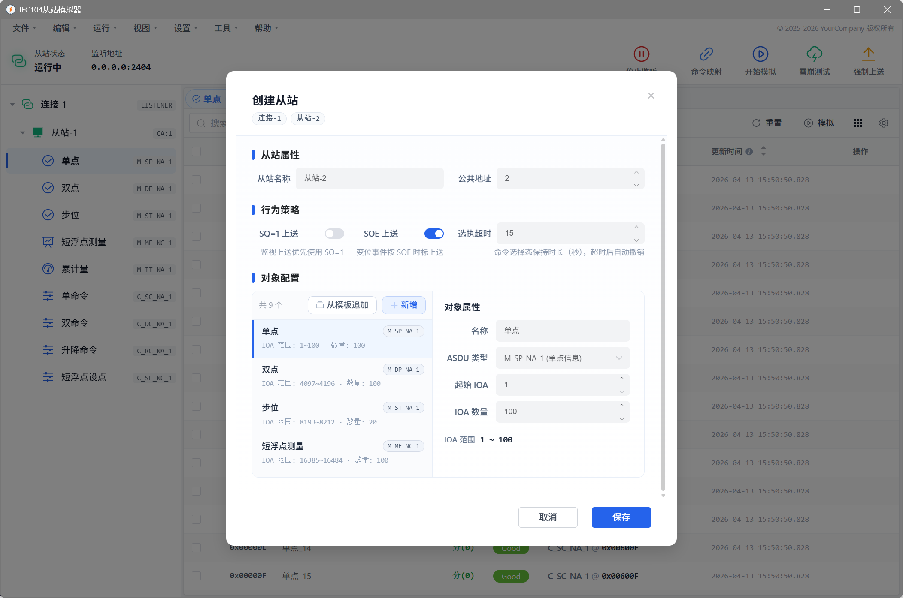

从站数据模拟
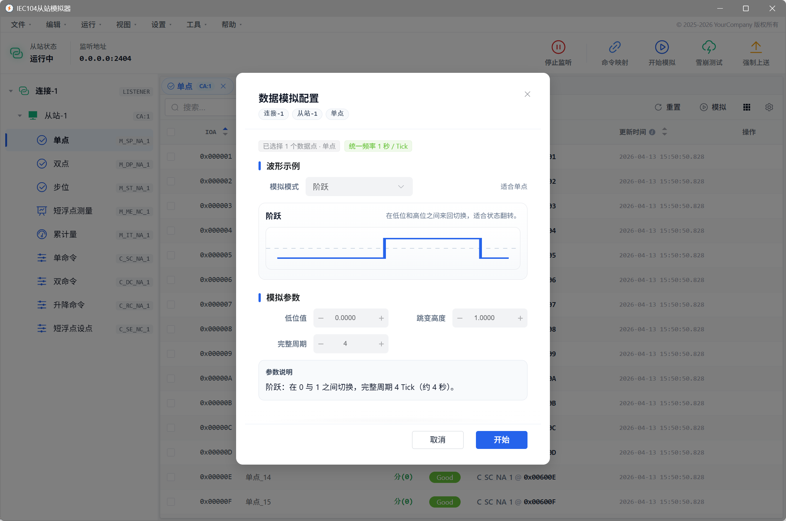

从站报文监控
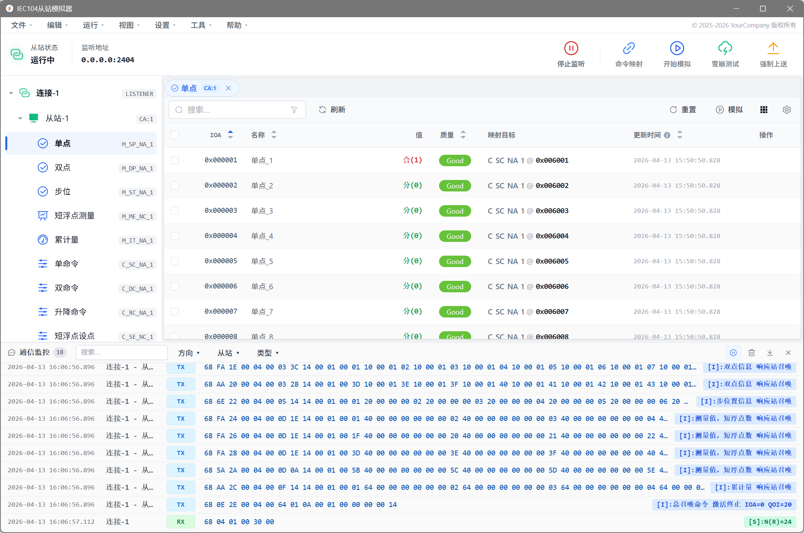

从站SOE监控
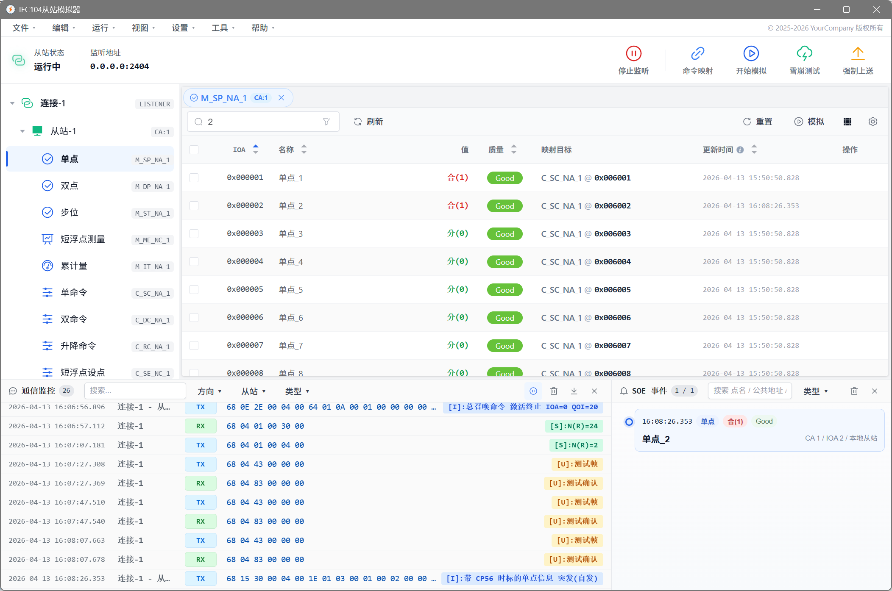

主站遥控
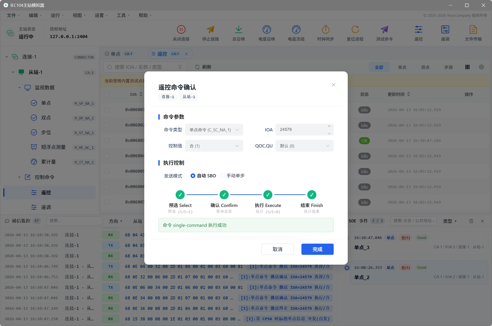

主站点位历史
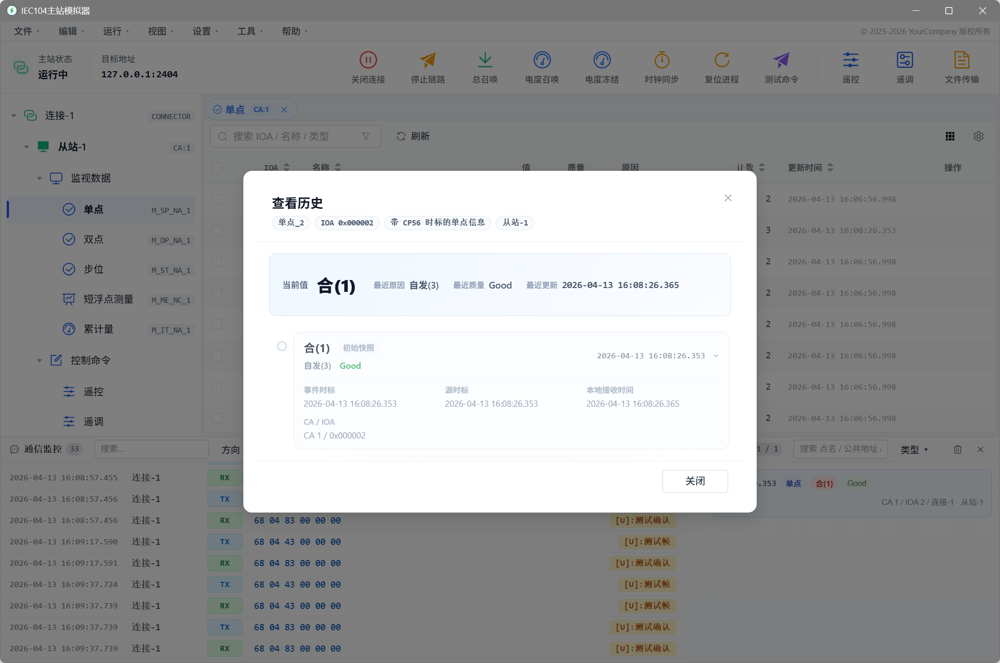

主站报文监控
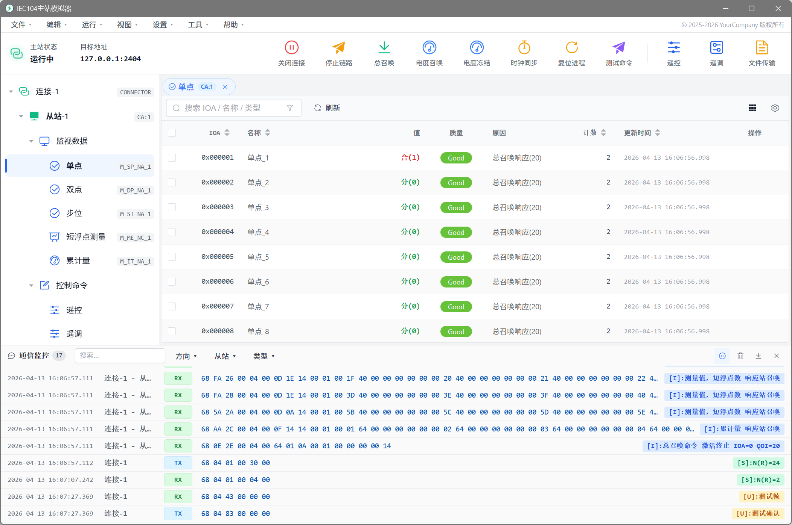

报文详情
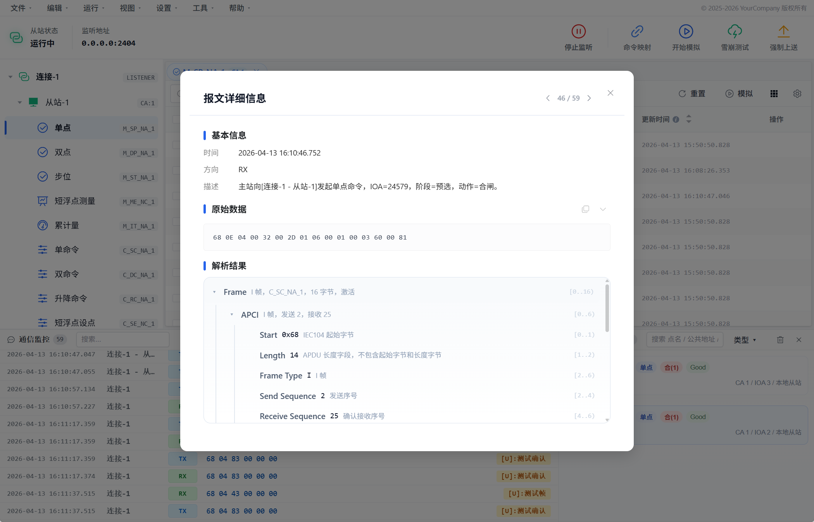