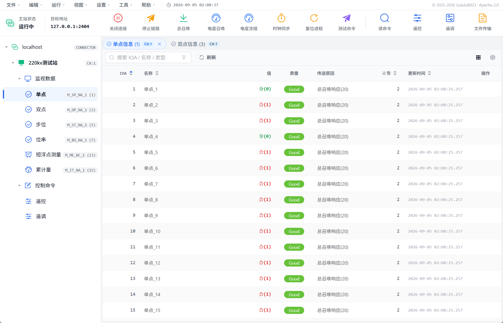
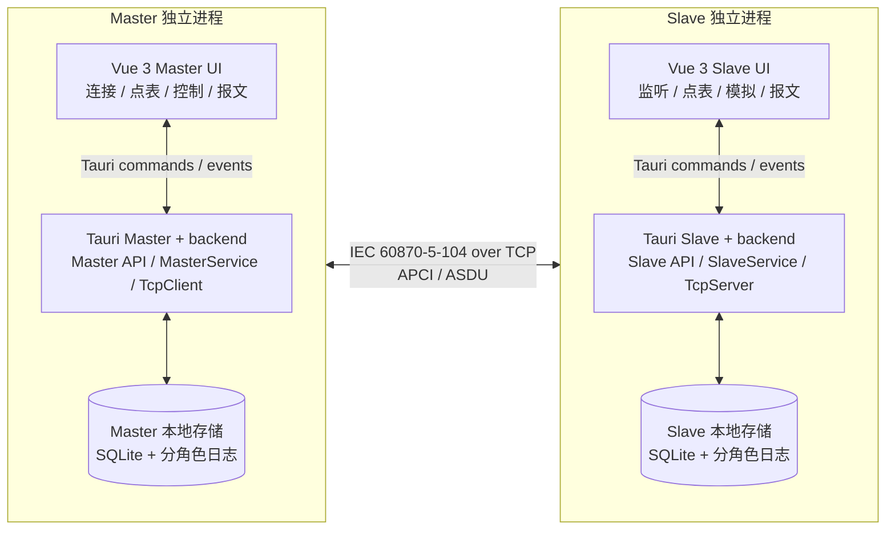

# IEC104 Simulator

[English documentation](./docs/en-US/README.md) · [Releases](https://github.com/Gululu8023/iec104-simulator/releases) · [Apache License 2.0](./LICENSE)

[](https://github.com/Gululu8023/iec104-simulator/releases)
[](./LICENSE)


IEC104 Simulator 是一套面向 IEC 60870-5-104 开发与联调的桌面工具，包含可独立安装的主站模拟器和从站模拟器。它把连接管理、链路状态、点表、控制流程、数据模拟、文件传输和报文解析放在同一套可观察界面中，用于在没有真实调度端或现场设备时构造一条可重复的本地测试链路。

项目重点不是宣称覆盖协议的每个可选章节，而是让常见 IEC104 业务流程能够被配置、执行、观察和复现：Master 可以验证从站响应与点表，Slave 可以模拟多公共地址设备和数据变化，两端共享一致的解析、存储和报文展示能力。

> 本项目用于开发、联调、功能验证和报文分析，不是生产级调度或安全控制系统。完整能力边界见[协议支持范围](./docs/zh-CN/protocol-support.md)。

## 适用场景

- IEC104 主站或从站软件开发时的功能联调与回归验证。
- 在接入真实设备前核对公共地址、IOA、ASDU 类型、召唤分组和控制映射。
- 复现 STARTDT、总召、SBO/直接执行、自动重连和文件传输流程。
- 使用虚构点表生成遥信、遥测、累计量、SOE 和波形数据。
- 查看、导出或独立解析 IEC104 APDU，辅助培训和问题定位。

本项目不适合作为生产 SCADA、规约网关、安全防护设备、合规测试套件或性能基准工具，也不应未经授权连接生产网络。

## 功能概览

### 主站模拟器

- 管理 TCP Link 及其下属逻辑 Slave，支持自动连接、重连、STARTDT 和总召。
- 支持 STARTDT/STOPDT、TESTFR、站总召、1–16 组召和电度召唤。
- 支持单点、双点、升降、三类设点、位串及相应 CP56Time2a 命令。
- 支持读命令、测试命令、时钟同步和复位进程。
- 支持文件目录、日志查询、文件上传和下载。

### 从站模拟器

- 在一个 Listener 下配置多个逻辑 Slave，并分别设置公共地址和点表。
- 支持 strict、compatible、debug 三种命令类型错配策略。
- 支持 SBO 或直接执行、选择超时、控制点到监视点映射。
- 支持 SQ=1、SOE、召唤组、电度组、自发上送和强制上送。
- 支持按点类型约束的 15 种波形以及遥信雪崩测试。

### 通用能力

- CSV、JSON、XML 点表导入以及导入前预检；下载模板为 CSV。
- 实时报文监控、表格/树形解析和独立十六进制报文解析器。
- 通信报文可导出为 CSV、TXT、PCAP 或 PCAPNG。
- 配置和运行数据保存在本地 SQLite 数据库中。
- 简体中文和 English 界面。

## 界面预览

以下界面使用本机回环链路和虚构点表演示；完整操作步骤见[用户指南](./docs/zh-CN/user-guide.md)。

| 主站连接、总召与数据视图 | 从站数据模拟 |
| --- | --- |
|  |  |
| **SBO 控制闭环** | **报文树形解析** |
|  |  |

## 技术栈

| 层次 | 技术 | 用途 |
| --- | --- | --- |
| 桌面框架 | Tauri 2 | Master/Slave Windows 桌面应用、IPC 与安装包 |
| 后端 | Rust 2024、Tokio | IEC104 链路、协议业务、并发任务和文件传输 |
| 协议解析 | `iec60870-parser` | 仓库内独立版本的 IEC 60870-5-104 解析组件 |
| 数据存储 | SQLite、rusqlite | 本地配置、点表和运行值持久化 |
| 前端 | Vue 3、TypeScript、Element Plus | 双应用界面与共享组件 |
| 工程化 | Vite 6、pnpm 9.15 | 前端构建与 workspace 依赖管理 |

应用产品版本与 `iec60870-parser` 组件版本独立管理；v1.0.0 中解析器保持 0.1.0。

## 架构与仓库结构

Master 和 Slave 是两个独立的 Tauri 进程。它们复用相同的 Rust backend crate、`iec60870-parser`、Vue 共享组件和文档，但这些共享代码会分别编译或打包进两个应用，并不存在常驻的“共享后端服务”。运行配置、点值和日志由各自进程管理，两端只通过 IEC104 TCP 链路交换协议报文。

### 运行时架构


```mermaid
flowchart LR
  subgraph Master["Master 独立进程"]
    direction TB
    MUI["Vue 3 Master UI<br/>连接 / 点表 / 控制 / 报文"]
    MRT["Tauri Master + backend<br/>Master API / MasterService / TcpClient"]
    MSTORE[("Master 本地存储<br/>SQLite + 分角色日志")]
    MUI <-->|"Tauri commands / events"| MRT
    MRT <--> MSTORE
  end

  subgraph Slave["Slave 独立进程"]
    direction TB
    SUI["Vue 3 Slave UI<br/>监听 / 点表 / 模拟 / 报文"]
    SRT["Tauri Slave + backend<br/>Slave API / SlaveService / TcpServer"]
    SSTORE[("Slave 本地存储<br/>SQLite + 分角色日志")]
    SUI <-->|"Tauri commands / events"| SRT
    SRT <--> SSTORE
  end

  Master <-->|"IEC 60870-5-104 over TCP<br/>APCI / ASDU"| Slave
```

### 边界说明

- **进程边界**：Master 和 Slave 可单独安装、启动和退出，任何一方都不依赖另一方的进程内状态。
- **接口边界**：Vue 前端通过 Tauri command 调用 Rust，通过 runtime event 接收状态和数据变化。
- **协议边界**：Master 的 `TcpClient` 与 Slave 的 `TcpServer` 使用标准 IEC104 TCP/APCI/ASDU 交互，也可以分别连接其他实现。
- **数据边界**：两端使用独立 SQLite 和日志目录，不共享数据库；`frontend/shared` 和 Rust crates 仅表示代码复用。

### 仓库结构

```text
iec104-simulator/
├─ frontend/
│  ├─ master/src/                 Master Vue 页面、状态与业务交互
│  ├─ slave/src/                  Slave Vue 页面、状态与业务交互
│  └─ shared/                     公共组件、IPC API、类型、i18n、Help 与样式
├─ src-tauri/
│  ├─ Cargo.toml                  Rust 虚拟 workspace 与统一依赖
│  ├─ apps/
│  │  ├─ master/                  Master 入口、Tauri 配置、权限与打包资源
│  │  └─ slave/                   Slave 入口、Tauri 配置、权限与打包资源
│  └─ libs/
│     ├─ backend/src/
│     │  ├─ api/                  Tauri command 与前后端 DTO 边界
│     │  ├─ services/             StationManager 与运行时事件桥接
│     │  ├─ core/{master,slave,shared}/
│     │  │                         主从业务、命令、模拟、文件与报文流程
│     │  ├─ network/              TCP client/server、连接与协议适配
│     │  └─ db/                   SQLite schema、模型与持久化操作
│     └─ iec60870-parser/src/     APCI/ASDU、流解析、校验与编解码
├─ docs/{zh-CN,en-US}/            双语用户、点表、协议与开发文档
├─ docs/releases/                 GitHub Release 正文
├─ assets/screenshots/            README 与用户指南截图
├─ scripts/                       发布一致性与国际化校验
└─ .github/                       GitHub 仓库模板与配置
```

## 下载、安装与升级

v1.0.0 官方安装包面向 Windows 10/11 x64。请从 [GitHub Releases](https://github.com/Gululu8023/iec104-simulator/releases) 下载：

- `master`：连接和测试 IEC104 从站。
- `slave`：监听 IEC104 主站并模拟设备行为。
- 本机联调可以同时安装并运行两者。

安装器依赖 Microsoft Edge WebView2；Windows 11 通常已包含，缺失时安装器可能需要联网获取。Linux 和 macOS 源码构建尚未列入 v1.0.0 官方验证范围。

应用优先将数据写到可执行文件旁的 `data/master/`、`data/slave/`、`logs/master/` 或 `logs/slave/`；该位置不可写时回退到对应的 Tauri 应用数据目录，实际路径会记录在启动日志中。

v1 不自动迁移 pre-v1 数据库。升级前应退出两个应用并备份 `iec104_simulator.db`、点表和配置。如果 v1 提示数据库结构不兼容，请保留备份并重命名旧数据库，再启动 v1 创建新库，不要用旧库覆盖新库。

## 五分钟本机联调

1. 在从站模拟器创建 Listener，监听 `127.0.0.1:2404`。
2. 在 Listener 下创建逻辑 Slave，设置公共地址并添加或导入点表。
3. 启动监听。
4. 在主站模拟器创建指向 `127.0.0.1:2404` 的 Link，再在 Link 下创建公共地址相同的逻辑 Slave。
5. 建立 TCP 连接并执行 STARTDT；随后发起站总召。
6. 在通信监控和点表页确认收发报文及数据，按需测试控制或模拟功能。

更完整的主从站操作说明见[用户指南](./docs/zh-CN/user-guide.md)。

## 使用边界

- 不宣称覆盖 IEC 60870-5-104 的全部类型、可选章节或厂商扩展。
- COT、公共地址和 IOA 长度固定为 2、2、3 字节，UI 不提供切换。
- 参数类和安全扩展 ASDU 只有部分解析能力，没有完整发送和从站业务流程。
- 点表只提供 CSV、JSON、XML 导入；没有点表导出，200 条仅为预览显示上限。
- 文件传输采用单节模式，并受 `max_asdu_bytes` 和单连接单任务限制。
- 不提供周期上报、遥测阈值上报、上报延迟、遥控失败概率或预设工况场景。
- 雪崩测试只翻转当前逻辑 Slave 的遥信点，不是网络压力或故障注入工具。

## 常见问题

- **无法连接**：核对 Master Link 与 Slave Listener 的 IP/端口、监听状态、端口占用和 Windows 防火墙。
- **TCP 已连接但没有数据**：确认 STARTDT 已完成、主从公共地址一致，并手动执行站总召。
- **控制被拒绝**：核对 IOA、ASDU 类型以及主站发送模式与从站 SBO/直接执行配置。
- **模拟值没有上送**：确认 Listener 正在运行、对端已完成 STARTDT，并启用了自动上送。
- **SOE 面板没有事件**：在逻辑 Slave 的行为策略中启用“SOE 上送”，确认对端已完成 STARTDT，再触发点值变化；若由遥控触发，还要确认监视点的 `control_ioa` 仍映射到该控制点。未启用 SOE 或没有有效控制映射时，不会产生对应的遥控 SOE。
- **点表导入失败**：使用 CSV、JSON 或 XML；严格追加模式遇到任一已有 IOA 会整批拒绝。
- **旧数据库不兼容**：不要删除原库；备份并重命名后让 v1 创建新库。

## 文档

- [用户指南](./docs/zh-CN/user-guide.md)
- [点表格式](./docs/zh-CN/point-table-format.md)
- [协议支持范围与已知限制](./docs/zh-CN/protocol-support.md)
- [源码构建](./docs/zh-CN/development.md)
- [变更记录](./CHANGELOG.md)

## 从源码构建

Windows 构建需要 Node.js 20 LTS、pnpm 9.15、Rust 1.88+、WebView2，以及 Visual Studio Build Tools 的“使用 C++ 的桌面开发”工作负载。

```powershell
corepack enable
pnpm install --frozen-lockfile
pnpm tauri:dev:master
pnpm tauri:dev:slave
```

完整命令和目录说明见[开发文档](./docs/zh-CN/development.md)。

## 发布与维护

- 当前产品版本为 **1.0.0**，完整新增、变更、修复和兼容性记录见 [CHANGELOG.md](./CHANGELOG.md)。
- 普通缺陷和建议请提交 [GitHub Issue](https://github.com/Gululu8023/iec104-simulator/issues)，并附版本、复现步骤和脱敏信息。
- 未公开的安全漏洞不要提交公开 Issue，请按 [SECURITY.md](./SECURITY.md) 发送至 `vergilsparda0905@gmail.com`。
- 贡献代码前请阅读 [CONTRIBUTING.md](./CONTRIBUTING.md)。

## 许可证

Copyright 2025-2026 Gululu8023。本项目依据 [Apache License 2.0](./LICENSE) 发布；该版权归属同时记录在随发行物提供的 [NOTICE](./NOTICE) 中。第三方组件继续遵循各自许可证，详见 [THIRD_PARTY_NOTICES.md](./THIRD_PARTY_NOTICES.md)。
