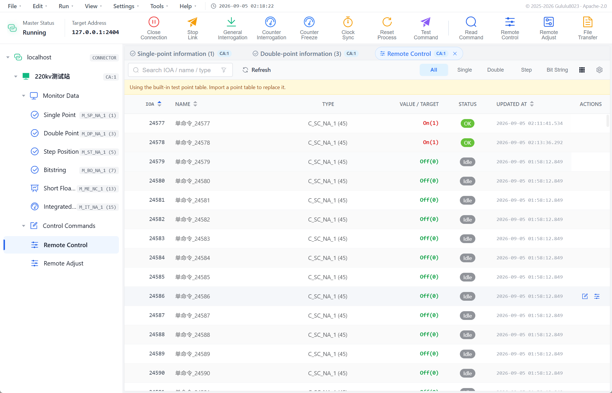
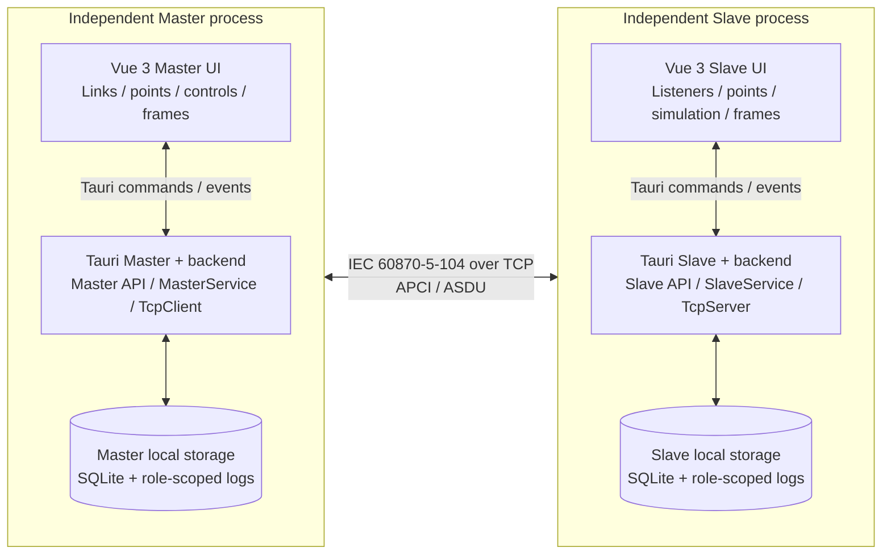

# IEC104 Simulator

[中文首页](../../README.md) · [Releases](https://github.com/Gululu8023/iec104-simulator/releases) · [Apache License 2.0](../../LICENSE)

IEC104 Simulator is a desktop development and integration tool for IEC 60870-5-104, delivered as separately installable Master and Slave applications. It brings connection management, link state, point tables, controls, simulation, file transfer, and frame analysis into one observable workflow, making it possible to build a repeatable local test link without a real control center or field device.

The project does not aim to claim every optional part of the protocol. It focuses on making common IEC104 workflows configurable, executable, observable, and reproducible: Master validates slave responses and point definitions, Slave simulates multiple common addresses and changing data, and both applications share consistent parsing, persistence, and frame presentation.

> This project is intended for development, integration testing, functional verification, and frame analysis. It is not a production dispatch or safety control system. Review [Protocol Support](./protocol-support.md) for the complete capability boundary.

## Intended Use

- Functional integration and regression checks while developing IEC104 Master or Slave software.
- Verification of common addresses, IOAs, ASDU types, interrogation groups, and control mappings before connecting real equipment.
- Reproduction of STARTDT, interrogation, SBO/direct control, reconnect, and file-transfer workflows.
- Generation of synthetic indications, measurements, totals, SOE, and waveform data from fictional point tables.
- Inspection, export, and standalone parsing of IEC104 APDUs for training and troubleshooting.

This project is not a production SCADA system, protocol gateway, security appliance, conformance suite, or performance benchmark. Do not connect it to a production network without authorization.

## Features

### Master

- Manage TCP Links and their logical Slaves, including automatic connection, reconnect, STARTDT, and interrogation.
- Send STARTDT/STOPDT, TESTFR, station/group interrogation, and counter interrogation.
- Send single, double, regulating-step, setpoint, and bit-string commands, including their CP56Time2a variants.
- Send read, test, clock synchronization, and reset-process commands.
- Request directories and logs, upload files, and download files.

### Slave

- Configure multiple logical Slaves with separate common addresses and point tables under one Listener.
- Select strict, compatible, or debug command-type mismatch behavior.
- Use select-before-operate or direct execution, selection timeout, and control-to-monitor mappings.
- Provide SQ=1, SOE, interrogation/counter groups, spontaneous upload, and forced upload.
- Run 15 point-type-aware simulation waveforms and binary avalanche testing.

### Shared

- Preview and import CSV, JSON, and XML point tables; the downloadable template is CSV.
- Inspect live frames in table/tree views and parse one hexadecimal APDU independently.
- Export communication frames as CSV, TXT, PCAP, or PCAPNG.
- Store configuration and runtime data in a local SQLite database.
- Use Simplified Chinese or English UI and Help content.

## Interface Preview

These screens use a loopback connection and fictional point data. See the [User Guide](./user-guide.md) for complete workflows.

| Master connection, interrogation, and data | Slave data simulation |
| --- | --- |
|  |  |
| **SBO control workflow** | **Frame tree analysis** |
|  |  |

## Technology Stack

| Layer | Technology | Purpose |
| --- | --- | --- |
| Desktop | Tauri 2 | Master/Slave Windows applications, IPC, and packaging |
| Backend | Rust 2024, Tokio | IEC104 links, protocol workflows, concurrent tasks, and file transfer |
| Protocol parser | `iec60870-parser` | Independently versioned IEC 60870-5-104 parser in this repository |
| Storage | SQLite, rusqlite | Local configuration, point tables, and runtime-value persistence |
| Frontend | Vue 3, TypeScript, Element Plus | Both application interfaces and shared components |
| Tooling | Vite 6, pnpm 9.15 | Frontend builds and workspace dependency management |

The application product and `iec60870-parser` use independent versions; the parser remains at 0.1.0 in product v1.0.0.

## Architecture and Repository Layout

Master and Slave run as independent Tauri processes. They reuse the same Rust backend crate, `iec60870-parser`, shared Vue components, and documentation, but that code is compiled or bundled separately into each application; there is no resident "shared backend service." Each process owns its configuration, point values, and logs. The applications exchange protocol frames only through an IEC104 TCP link.

### Runtime Architecture



### Boundary Notes

- **Process boundary:** Master and Slave can be installed, started, and stopped independently; neither relies on the other's in-process state.
- **Interface boundary:** Vue calls Rust through Tauri commands and receives state and data changes through runtime events.
- **Protocol boundary:** Master's `TcpClient` and Slave's `TcpServer` exchange standard IEC104 TCP/APCI/ASDU traffic and can independently connect to other implementations.
- **Data boundary:** each side has a separate SQLite database and log directory. `frontend/shared` and the Rust crates represent source reuse only.

### Repository Layout

```text
iec104-simulator/
├─ frontend/
│  ├─ master/src/                 Master Vue views, state, and workflows
│  ├─ slave/src/                  Slave Vue views, state, and workflows
│  └─ shared/                     Components, IPC APIs, types, i18n, Help, and styles
├─ src-tauri/
│  ├─ Cargo.toml                  Rust virtual workspace and shared dependencies
│  ├─ apps/
│  │  ├─ master/                  Master entrypoint, Tauri config, permissions, and bundle assets
│  │  └─ slave/                   Slave entrypoint, Tauri config, permissions, and bundle assets
│  └─ libs/
│     ├─ backend/src/
│     │  ├─ api/                  Tauri commands and frontend/backend DTO boundary
│     │  ├─ services/             StationManager and runtime-event bridge
│     │  ├─ core/{master,slave,shared}/
│     │  │                         Master/Slave workflows, commands, simulation, files, and frames
│     │  ├─ network/              TCP client/server, connections, and protocol adapter
│     │  └─ db/                   SQLite schema, models, and persistence operations
│     └─ iec60870-parser/src/     APCI/ASDU parsing, validation, streaming, and encoding
├─ docs/{zh-CN,en-US}/            Bilingual user, point-table, protocol, and development docs
├─ docs/releases/                 GitHub Release body
├─ assets/screenshots/            README and user-guide screenshots
├─ scripts/                       Release-consistency and localization checks
└─ .github/                       GitHub templates and repository configuration
```

## Download, Installation, and Upgrade

Official v1.0.0 installers target Windows 10/11 x64. Download the package for your role from [GitHub Releases](https://github.com/Gululu8023/iec104-simulator/releases):

- `master` connects to and tests IEC104 slave devices.
- `slave` listens for an IEC104 master and simulates device behavior.
- Both applications may be installed for loopback integration testing.

Microsoft Edge WebView2 is required. Windows 11 normally includes it; otherwise, the default installer may need network access. Linux and macOS source builds are outside the verified v1.0.0 release scope.

The applications first write data under `data/master/`, `data/slave/`, `logs/master/`, or `logs/slave/` beside the executable. If that location is not writable, they fall back to the corresponding Tauri application data directory. The startup log records the effective paths.

v1 does not migrate pre-v1 databases. Exit both applications and back up `iec104_simulator.db`, point tables, and configuration before upgrading. If v1 reports an incompatible schema, preserve and rename the old database, then let v1 create a new one. Do not overwrite the new database with the old file.

## Five-minute Loopback Setup

1. In Slave, create a Listener on `127.0.0.1:2404`.
2. Create a logical Slave under that Listener, set its common address, and add or import points.
3. Start the Listener.
4. In Master, create a Link to `127.0.0.1:2404`, then add a logical Slave with the same common address.
5. Connect, complete STARTDT, and send station interrogation.
6. Confirm frames and point values, then exercise controls or simulation as needed.

See the [User Guide](./user-guide.md) for complete Master and Slave workflows.

## Capability Boundaries

- The project does not claim complete coverage of every IEC 60870-5-104 type, optional section, or vendor extension.
- COT, common address, and IOA lengths are fixed at 2, 2, and 3 bytes; the UI does not switch them.
- Parameter and security-extension ASDUs have partial parsing only, without complete send or Slave workflows.
- Point tables support CSV, JSON, and XML import but not export. The 200-record limit applies only to preview display.
- File transfer is single-section and constrained by `max_asdu_bytes` and one task per connection.
- Periodic reporting, analog threshold reporting, reporting delay, control failure probability, and preset operating scenarios are unavailable.
- Avalanche testing flips binary indications on one logical Slave; it is not network stress or fault injection.

## Common Problems

- **Cannot connect:** check the Master Link and Slave Listener address, listening state, port availability, and Windows Firewall.
- **TCP connects but no data appears:** complete STARTDT, match common addresses, and send station interrogation.
- **A control is rejected:** verify the IOA, ASDU type, and that Master dispatch matches Slave SBO/direct mode.
- **Simulation does not upload:** confirm the Listener is running, STARTDT completed, and automatic upload is enabled.
- **The SOE panel stays empty:** enable **SOE Upload** in the logical Slave policy, complete STARTDT, and then change a point value. With SOE Upload disabled, ordinary spontaneous data is sent without a timestamp and is not added to the SOE panel.
- **Point-table import fails:** use CSV, JSON, or XML; append-only rejects the batch if any IOA already exists.
- **An old database is incompatible:** preserve and rename the backup, then let v1 create a new database.

## Documentation

- [User Guide](./user-guide.md)
- [Point Table Format](./point-table-format.md)
- [Protocol Support and Known Limitations](./protocol-support.md)
- [Development](./development.md)
- [Changelog](../../CHANGELOG.en.md)

## Build from Source

Windows builds require Node.js 20 LTS, pnpm 9.15, Rust 1.88+, WebView2, and the **Desktop development with C++** workload from Visual Studio Build Tools.

```powershell
corepack enable
pnpm install --frozen-lockfile
pnpm tauri:dev:master
pnpm tauri:dev:slave
```

See [Development](./development.md) for checks and workspace details.

## Releases and Maintenance

- The current product version is **1.0.0**. See [CHANGELOG.en.md](../../CHANGELOG.en.md) for additions, changes, fixes, compatibility notes, and release history.
- Use [GitHub Issues](https://github.com/Gululu8023/iec104-simulator/issues) for ordinary defects and proposals, including the version, reproduction steps, and sanitized diagnostics.
- Do not open a public Issue for an undisclosed vulnerability. Follow [SECURITY.md](../../SECURITY.md) and email `vergilsparda0905@gmail.com`.
- Read [CONTRIBUTING.md](../../CONTRIBUTING.md) before submitting code.

## License

Copyright 2025-2026 Gululu8023. IEC104 Simulator is licensed under the [Apache License 2.0](../../LICENSE); the same attribution is included in the distributed [NOTICE](../../NOTICE). Third-party components remain under their respective licenses as listed in [Third-party Software Notices](../../THIRD_PARTY_NOTICES.md).
