# User Guide

[Back to Home](./README.md) | [简体中文](../zh-CN/user-guide.md)

This document introduces the main UI and basic usage workflow of IEC104 Simulator.

## 1. Master Simulator

IEC104 Master Simulator is used to simulate an IEC104 master station. It can actively connect to slave devices and send general interrogation, control, setpoint, and clock synchronization commands.

### 1.1 Master Home

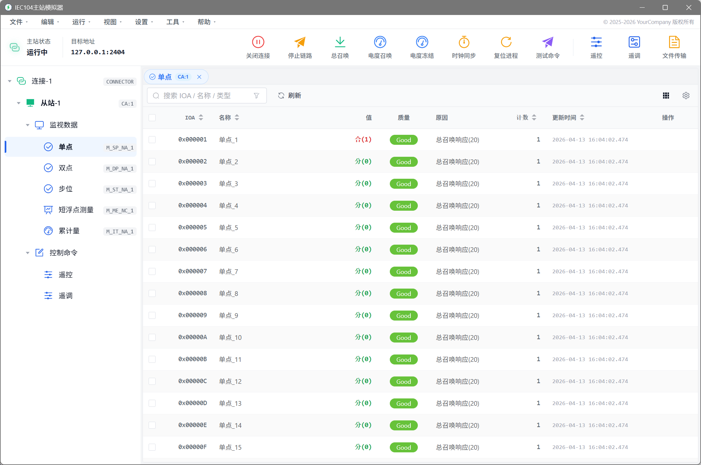

The Master home page is used to manage connection status, communication status, and main operation entries.

### 1.2 Master Disconnected State

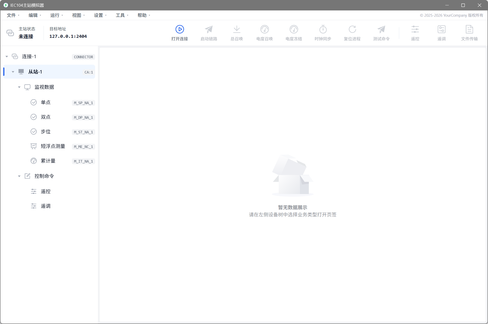

In the disconnected state, configure the slave IP address, port, and IEC104 communication parameters before establishing a connection.

### 1.3 Basic Workflow

1. Start IEC104 Master Simulator.
2. Configure the slave IP address and port.
3. Configure IEC104 communication parameters.
4. Click the connect button to establish the communication connection.
5. Send general interrogation, control, setpoint, or clock synchronization commands according to your test requirements.
6. View sent and received messages and parsed results in the message monitoring area.

### 1.4 Master Control Command

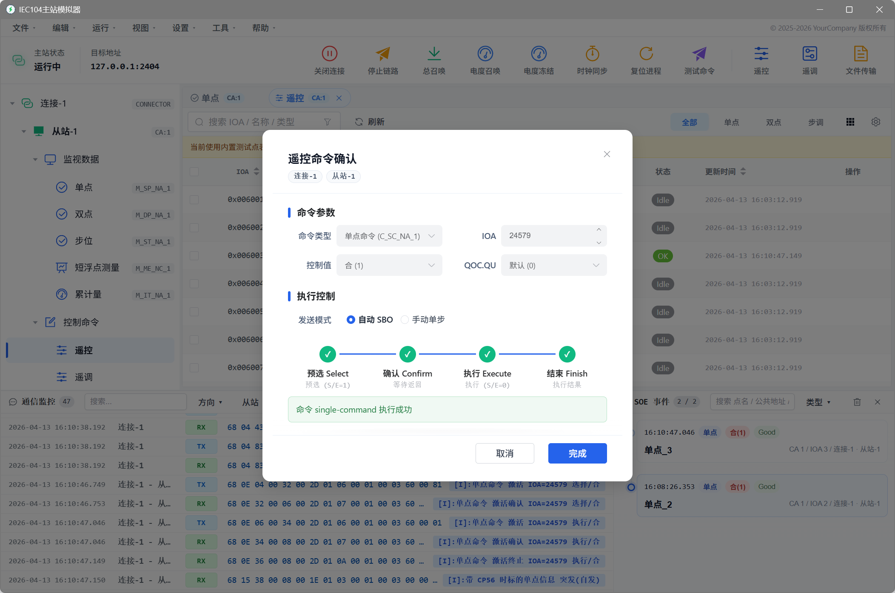

The control command function can be used to send control commands to a slave device and verify the slave-side control handling logic.

### 1.5 Master Point History

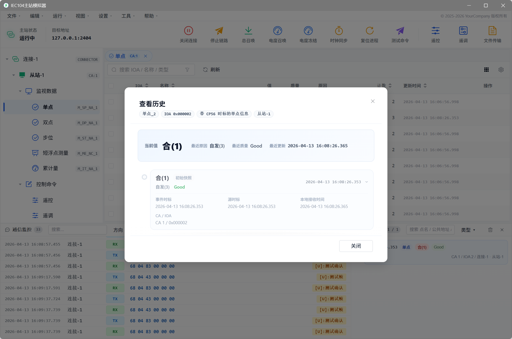

Point history can be used to view point value change records and analyze status or measurement changes.

### 1.6 Master Message Monitoring

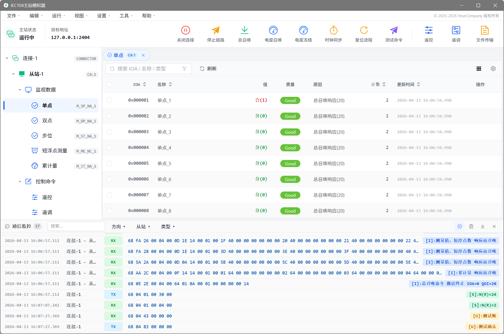

Master message monitoring displays sent and received messages, message direction, timestamps, and parsed results in real time.

## 2. Slave Simulator

IEC104 Slave Simulator is used to simulate an IEC104 slave device. It can listen for master connections and respond to general interrogation and control commands.

### 2.1 Slave Home

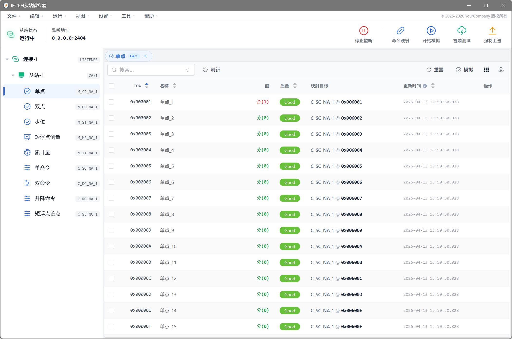

The Slave home page is used to view the slave running status, listening status, and master connection status.

### 2.2 Slave Disconnected State

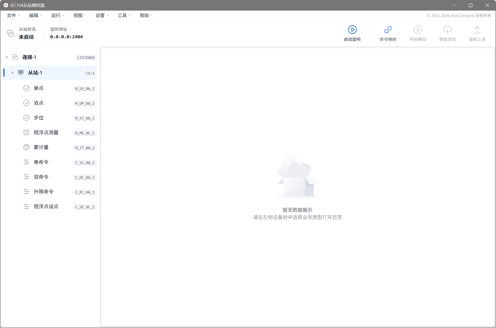

In the disconnected state, configure the listening address, listening port, and IEC104 communication parameters before starting the listener.

### 2.3 Basic Workflow

1. Start IEC104 Slave Simulator.
2. Configure the local listening IP and port.
3. Configure the common address and IEC104 communication parameters.
4. Create a station or import point table data.
5. Start listening.
6. Use a master tool to connect to Slave Simulator.
7. Simulate data changes or event uploads according to your test requirements.

### 2.4 Create Station

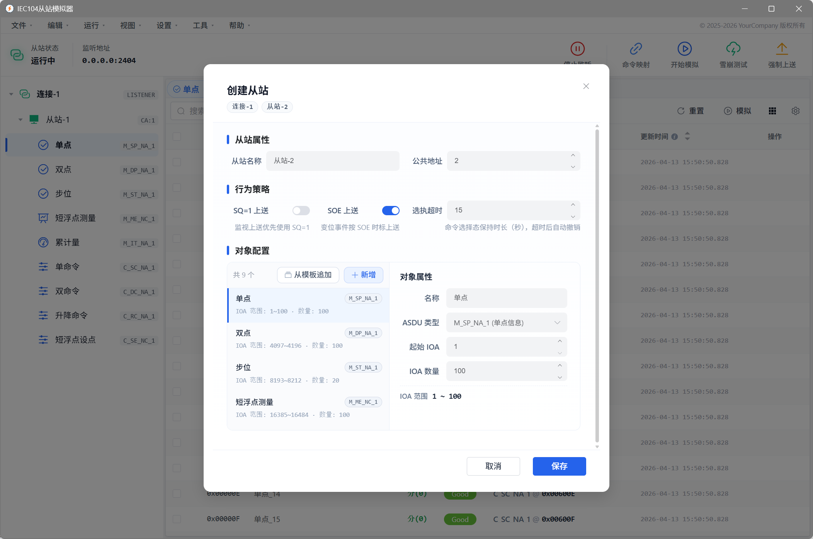

When creating a station, configure the station name, common address, point table, and related communication parameters.

### 2.5 Slave Data Simulation

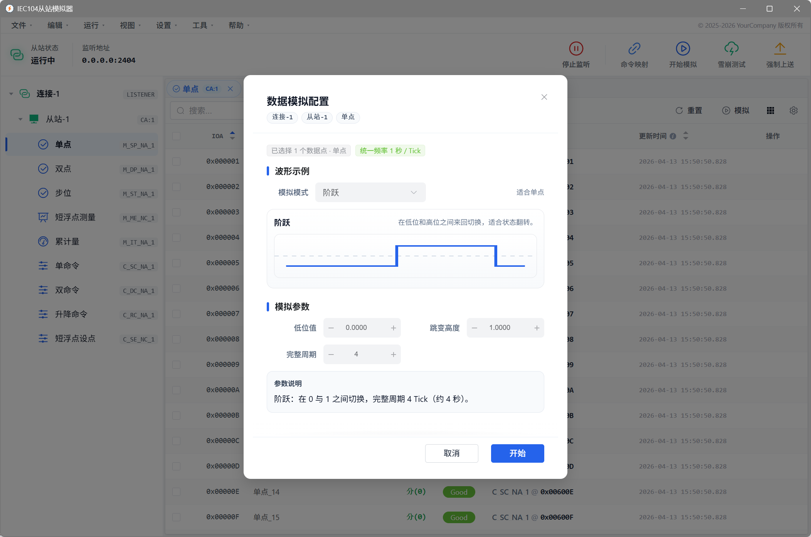

Slave data simulation can be used to simulate status, measurement, control, setpoint, and event data for master station integration and protocol testing.

### 2.6 Slave Message Monitoring

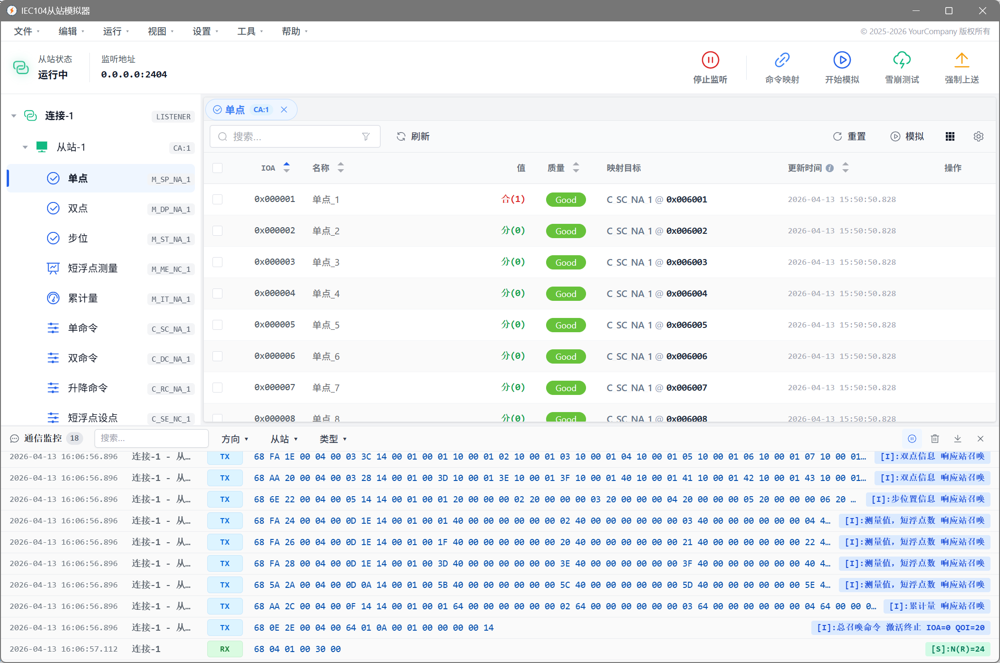

Slave message monitoring displays IEC104 communication messages between the master and the slave in real time.

### 2.7 Slave SOE Monitoring

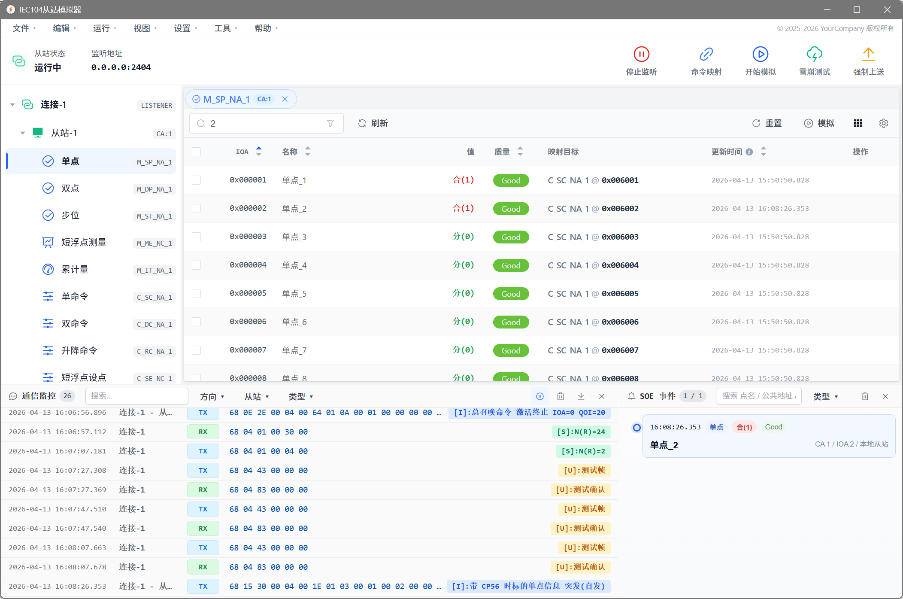

SOE monitoring is used to view sequence-of-events records and verify status changes, event uploads, and timestamp-related logic.

## 3. Message Details

IEC104 Simulator supports message detail viewing to analyze specific message structures and field meanings.

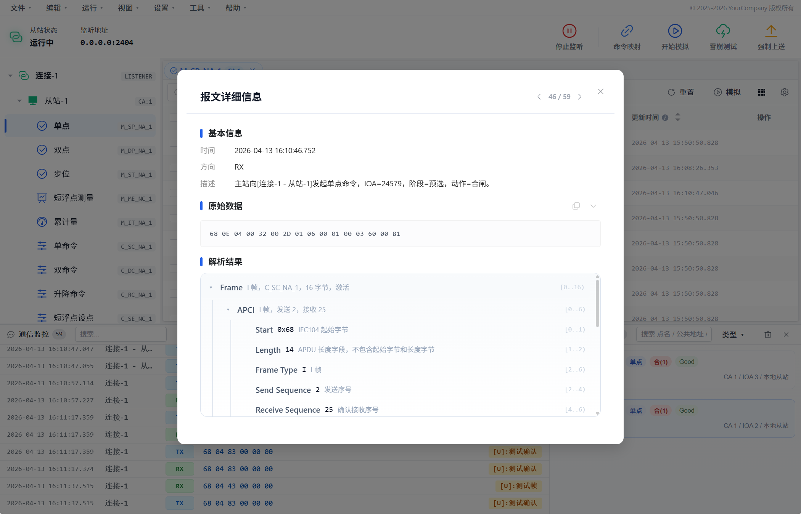

Message details can be used to:

- View raw messages.
- View message direction.
- View message time.
- View structured parsing results.
- Troubleshoot communication issues.
- Export PCAP or PCAPNG files for further analysis.

## 4. Language Switching

Starting from `v0.2.0`, IEC104 Simulator supports i18n.

Currently supported languages:

- Simplified Chinese.
- English.

If some UI text is not refreshed immediately after switching the language, try restarting the application.

## 5. Point Table Configuration

Slave Simulator supports simulated data based on point table configuration.

A point table usually describes the following information:

- Information object address.
- Point name.
- Data type.
- Initial value.
- Change status.
- Other test parameters.

The specific point table format is subject to the import template or sample file provided by the current version.

## 6. Data Simulation

Slave Simulator can simulate slave data based on the point table.

Common simulated data includes:

- Status data.
- Measurement data.
- Control data.
- Setpoint data.
- Event data.

The actual supported scope is subject to the UI of the current version.

## 7. Message Export

IEC104 Simulator supports exporting communication messages for further analysis with tools such as Wireshark.

Common export formats include:

- PCAP.
- PCAPNG.

The exported message files can be used for:

- Issue reproduction.
- Protocol analysis.
- Test reports.
- Further analysis with third-party tools.

## 8. Usage Recommendations

Before testing, it is recommended to check the following items:

- The IP and port configuration of the master and slave are correct.
- The IEC104 parameters are consistent with the peer device.
- Windows Firewall allows the application to communicate.
- The test point table matches the actual test scenario.
- The version number is consistent with the documentation.

## 9. Feedback

If you find any issues, please submit feedback in GitHub Issues and provide the following information as much as possible:

- Software version.
- Operating system version.
- Whether you are using Master or Slave.
- Steps to reproduce the issue.
- Error screenshots.
- Related logs or message files.