# IEC104 Simulator 用户指南

本指南说明 Master 和 Slave 的实际操作模型。协议类型与边界见[协议支持范围](./protocol-support.md)，导入字段见[点表格式](./point-table-format.md)。

## 对象模型

- Master 的 **Link** 代表一条 TCP 连接，保存远端地址、K/W/T0–T3、自动重连和自动动作；其下的**逻辑 Slave**保存公共地址和点表。
- Slave 的 **Listener** 负责监听本地 TCP 端口；其下的**逻辑 Slave**保存公共地址、点表、控制方式、SQ=1 和 SOE 策略。
- 创建 Link 或 Listener 后仍需创建逻辑 Slave。一个 TCP 端点可以承载多个公共地址不同的逻辑 Slave。

## 本机联调

1. 启动 Slave，创建名为“连接-1”的 Listener，监听 `127.0.0.1:2404`。
2. 在 Listener 下创建“从站-1”，公共地址设为 `1`，然后添加或导入测试点。
3. 选中 Listener 或逻辑 Slave并启动监听。
4. 启动 Master，创建指向 `127.0.0.1:2404` 的 Link，并在其下创建公共地址为 `1` 的逻辑 Slave。
5. 建立 TCP 连接；如果未启用自动动作，手动执行 STARTDT 和站总召。
6. 在数据页和通信监控中确认点值、品质、传送原因及收发报文。

TCP 已连接但未完成 STARTDT 时，IEC104 业务命令不会发送。

## Master 操作

### 连接生命周期

正常流程为 TCP 连接 → STARTDT 确认 → 业务命令 → 可选自动总召。自动重连覆盖远端断链和协议超时；用户主动断开不会触发重连。重连参数位于 Link 编辑窗口。

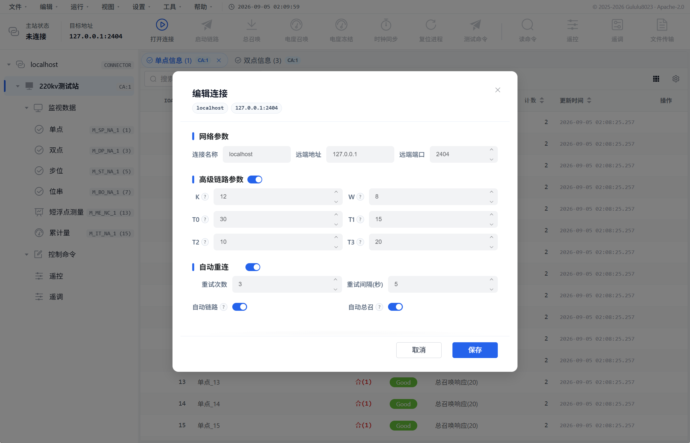

*Link 编辑窗口集中配置 K/W/T0–T3、重试策略、自动 STARTDT 和自动总召。*

### 采集与系统命令

顶部命令区提供：

- 站总召、1–16 组召；
- 全部电度、1–4 组电度召唤，以及读取、冻结、冻结并复位、复位限定词；
- 按 IOA 读取、时钟同步、复位进程和测试命令；
- 手动 STARTDT/STOPDT 和 TESTFR。

参数类 ASDU 没有完整发送流程。

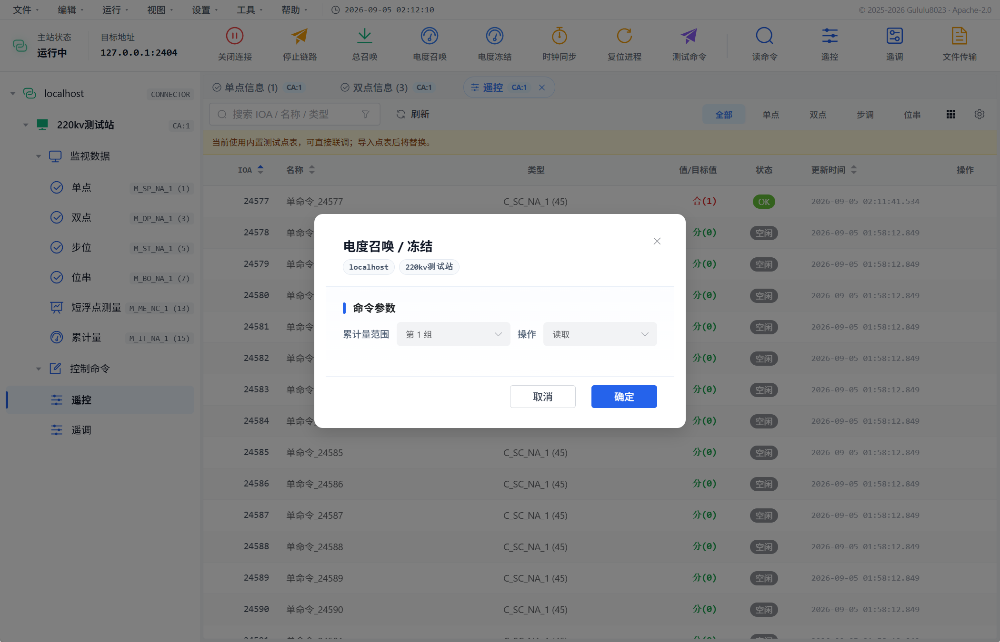

*电度召唤按全部或第 1–4 组选择范围，并明确读取、冻结、冻结并复位或复位操作。*

### 控制命令

支持单点、双点、升降、归一化设点、标度化设点、短浮点设点和 32 位位串，以及对应 CP56Time2a 类型。

- **自动 SBO**：Select 确认后自动发送 Execute。
- **手动单步**：分别发送 Select、Execute 或撤销。
- **直接执行**：只发送 Execute。

主站发送模式必须与从站 SBO/直接执行配置一致。结果以确认、终止、超时和通信报文为准。

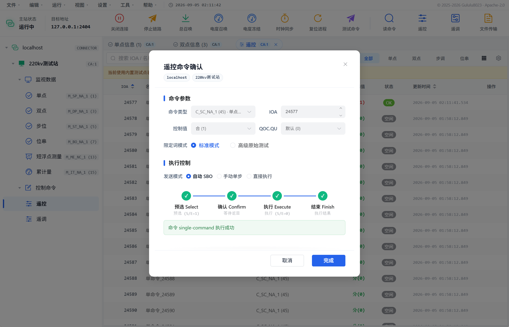

*自动 SBO 窗口展示 Select、Confirm、Execute 和 Finish 四个阶段，不能只以点值变化判断命令成功。*

### 点表与文件传输

Master 支持 CSV、JSON、XML 点表导入。严格追加遇到任一 IOA 冲突会整批拒绝；整表替换只影响当前逻辑 Slave。不提供点表导出。

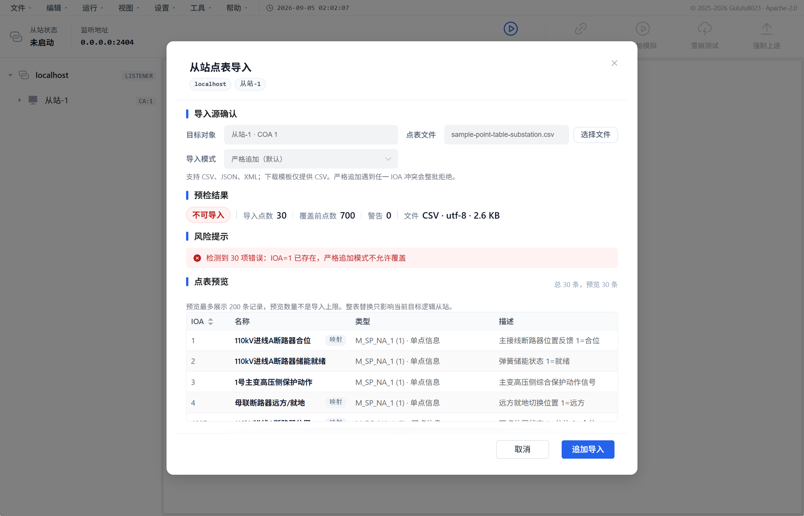

*示例故意展示 IOA 冲突：预检会在写入前列出错误、覆盖前点数和最多 200 条预览记录。*

完成 STARTDT 后可以获取远端目录、按文件名和时间查询日志、上传、下载或取消当前传输。同一连接只能运行一个任务；当前为单节传输，文件上限由最大 ASDU 大小动态计算。

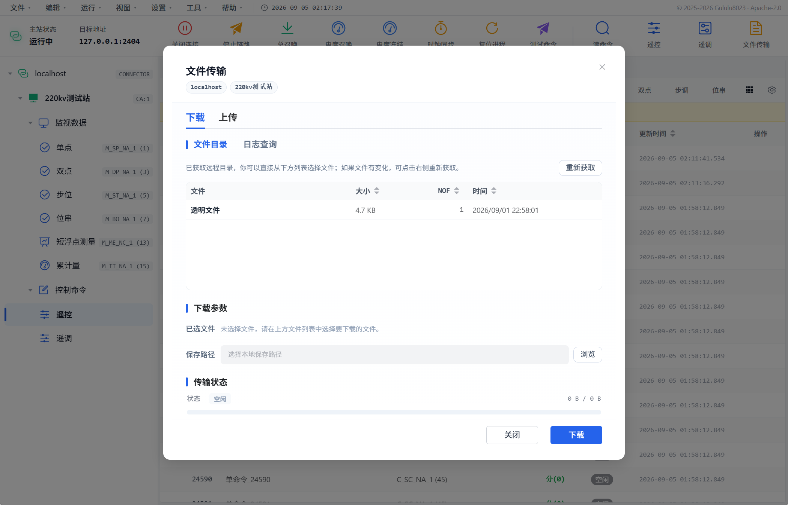

*文件传输必须在 STARTDT 完成后使用；选择远端目录条目和本地保存路径后才能开始下载。*

## Slave 操作

### 启停与行为策略

停止监听会先结束后台任务并冻结运行值，同时保留模拟配置和选点会话，供下次启动继续使用。

命令类型错配策略只处理命令 ASDU 类型与点表类型不一致的情况，不代表整个协议栈的兼容等级：

- **strict**：拒绝并返回否定确认；
- **compatible**：允许执行；
- **debug**：允许执行并记录详细告警。

每个逻辑 Slave 可选择 SBO 或直接执行；SBO 选择态超过配置时间会自动撤销。

### 点表与命令映射

可以用对象模板、手工编辑或 CSV/JSON/XML 导入点表。`control_ioa` 配置在监视点上，值为对应控制点 IOA。点位还可配置站/1–16 组召分组，以及全部/1–4 组电度分组。

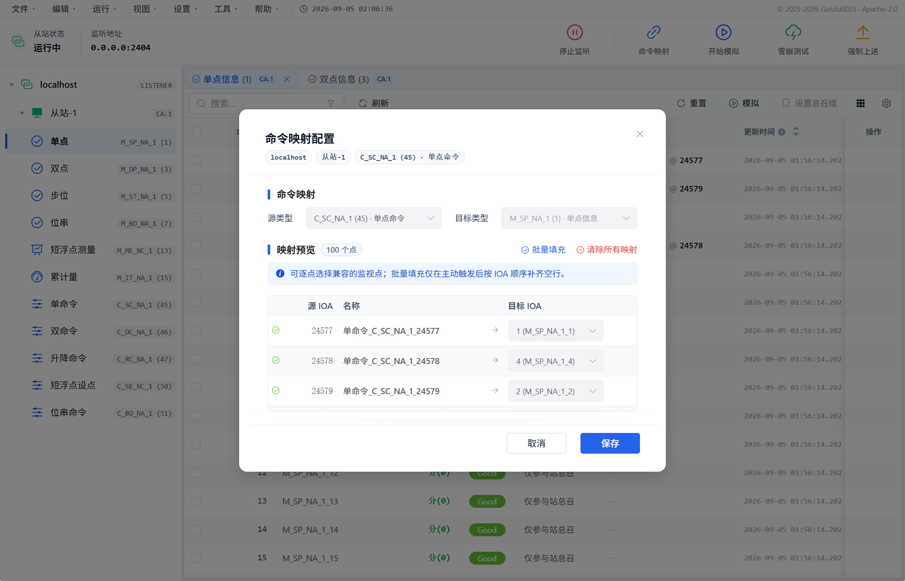

*映射以控制点为源、监视点为目标；批量填充只补齐尚未映射的兼容目标。*

### 命令响应与数据模拟

Slave 响应链路控制、总召、组召、电度召唤、常用控制和设点、位串、读、时钟同步、复位、测试命令及文件传输。参数类 ASDU 不执行业务设置。

数据模拟提供固定值、阶跃、脉冲、方波、升/降锯齿、三角波、正弦波、斜坡保持回落、梯级、指数逼近、阻尼振荡、随机值、随机游走和计数器，共 15 种模式。

- 自动上送要求模拟产生变化、启用自动上送且对端已完成 STARTDT。
- 强制上送同样要求有效的数据传输连接。
- 雪崩测试翻转当前逻辑 Slave 的遥信点，不模拟网络故障。
- SOE 只在逻辑 Slave 启用“SOE 上送”、对端完成 STARTDT 且点值发生变化时产生；遥控触发的 SOE 还要求监视点的 `control_ioa` 有效映射到该控制点。未启用时发送的是不带时标的普通自发数据，不会进入主从两端的 SOE 面板。没有遥测越限阈值配置。

| 模拟参数与波形预览 | 模拟运行状态 |
| --- | --- |
| 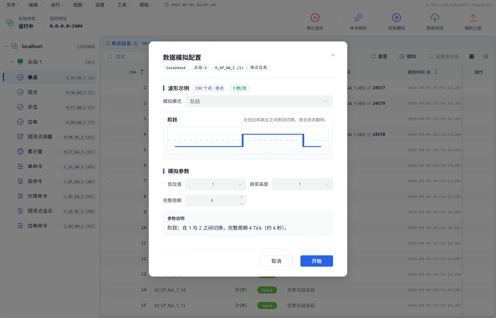 | 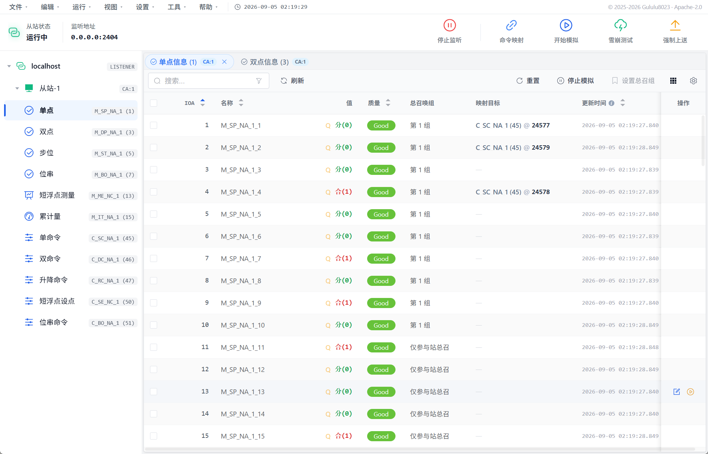 |

模拟启动后，工具栏和点表会显示停止入口及运行标记。停止监听会先停止模拟，因此停止完成后不应再看到点值或游标继续变化。雪崩测试没有独立配置窗口，执行结果以提示、点值和通信报文为准。

## 报文、SOE 与解析器

通信监控支持搜索、方向/从站/类型筛选、表格或树形详情，以及 CSV、TXT、PCAP、PCAPNG 导出。SOE 面板支持查看、筛选和清空，但没有独立 SOE CSV 导出。

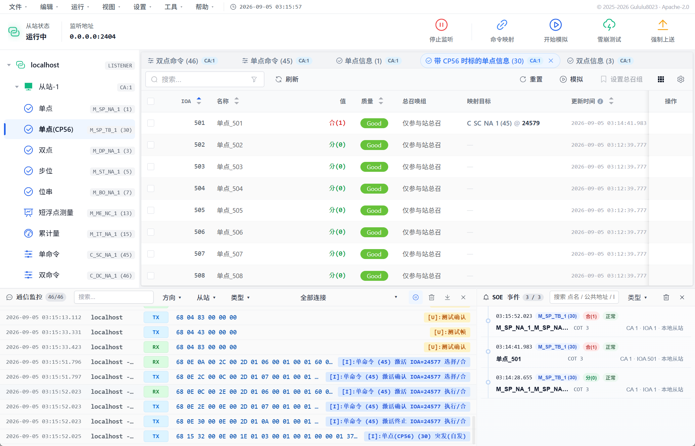

*图中遥控执行后，映射监视点以 Type 30、COT=3 上送，并同时进入 SOE 面板。*

| 通信监控 | 单帧树形详情 |
| --- | --- |
| 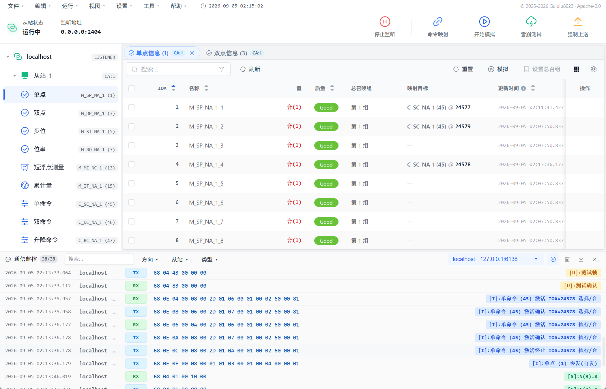 | 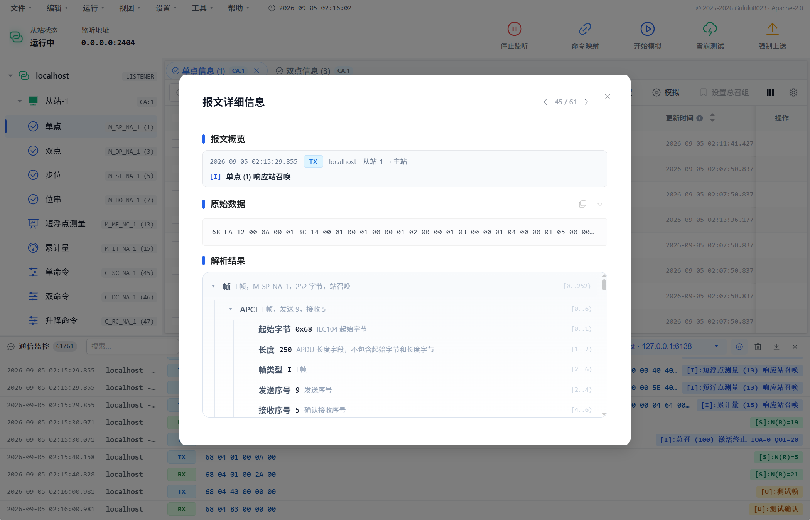 |

“工具 → 报文解析”一次解析一帧完整 APDU，输入应包含 `68` 起始字节和 APCI。

## 常见问题

### 无法建立连接

确认 Master Link 与 Slave Listener 的 IP/端口一致、Listener 已启动、端口未被占用，并检查 Windows 防火墙。只应连接获授权的测试网络。

### TCP 已连接但没有数据

确认 STARTDT 已完成，主从逻辑 Slave 的公共地址一致，然后手动执行站总召并检查通信监控。

### 控制被拒绝

核对 IOA、点表 ASDU 类型、主站发送模式和从站 SBO/直接执行配置。strict 模式下类型错配会返回否定确认。

### 模拟值变化但没有上送

确认 Listener 正在运行、对端已完成 STARTDT，并已启用自动上送。强制上送也需要有效的数据传输连接。

### 点表导入失败

仅使用 CSV、JSON 或 XML。CSV 标准类型名应放在 `data_type`；严格追加模式遇到已有 IOA 会整批拒绝。
